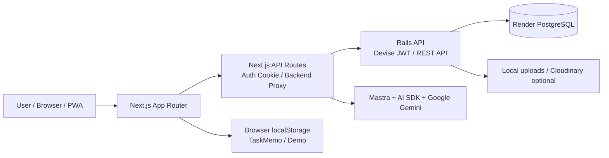
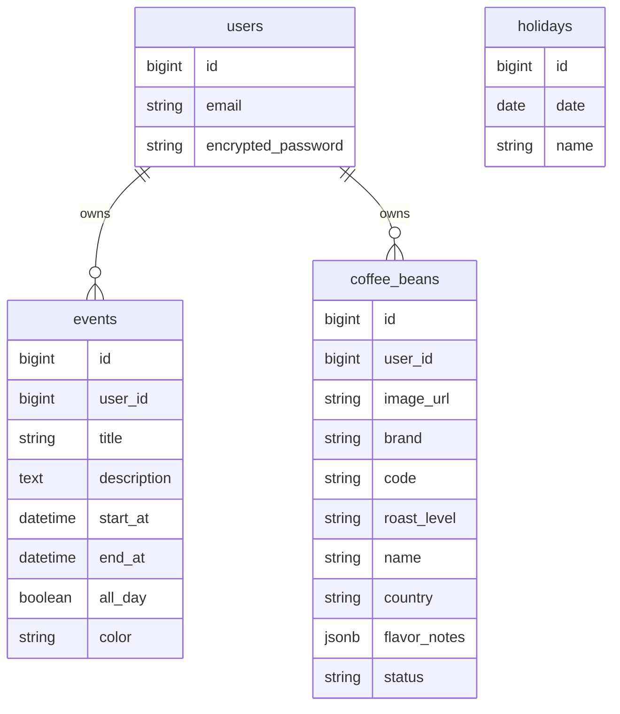

# Daily Life App

Daily Life App は、日常の予定管理、音声メモ、コーヒー豆記録を 1 つにまとめた個人向け PWA アプリケーションです。

スマートフォンと PC の両方から使えることを意識し、予定管理、音声入力、画像解析など、日常的に使う機能を 1 つのアプリにまとめました。

## URL

- App: https://evehapp.com/

## 実装画面

<table>
  <tr>
    <td align="center" width="33%">
      
      <br />
      Calendar
    </td>
    <td align="center" width="33%">
      
      <br />
      TaskMemo
    </td>
    <td align="center" width="33%">
      
      <br />
      Coffee
    </td>
  </tr>
</table>

## 主な機能

| 機能 | 内容 | 保存先 |
| --- | --- | --- |
| Calendar | 予定の作成・編集・削除、週表示・月表示、祝日表示、検索 | Render PostgreSQL |
| TaskMemo | 音声入力による文字起こしメモの作成、一覧表示、詳細表示、タイトル編集、削除 | Browser localStorage |
| Coffee | コーヒー豆パッケージ画像の AI 解析、豆情報の保存、一覧表示、詳細表示、削除 | Render PostgreSQL |
| Demo | ログインなしで Calendar / TaskMemo / Coffee の主要画面を確認 | mock / localStorage |

TaskMemo はフロントエンドのみで動作するローカル機能です。メモはブラウザの `localStorage` に保存し、Rails API / PostgreSQL には保存しません。

## 開発背景

PC とスマートフォンの両方で利用できるアプリが欲しいと考えたことが、開発のきっかけです。

日常的に使う機能を別々のアプリで管理するのではなく、1 つのアプリでまとめて扱えるようにしたいと考えました。

そのため、自分の生活や学習スタイルに合わせて使える、自分に最適化されたアプリを目指して開発しました。

## 使用技術

### Frontend

- Next.js
- React
- TypeScript
- Tailwind CSS
- App Router
- PWA manifest / Service Worker
- pnpm

### Backend

- Ruby on Rails 8.1 API
- PostgreSQL
- Devise + devise-jwt
- rack-cors
- rack-attack

### AI / Browser API

- Mastra
- AI SDK
- Google Gemini
- Web Speech API
- MediaRecorder API

### Infrastructure / Hosting

- Vercel
- Render
- Render PostgreSQL
- AWS Route 53
- 独自ドメイン: `https://evehapp.com/`

## アーキテクチャ



認証付き API 通信は、ブラウザから Rails API へ直接送らず、Next.js の `/api/backend/*` を経由します。

JWT はブラウザ JavaScript から読めない HttpOnly Cookie に保存し、フロントエンド側で token を直接扱わない構成にしています。

```txt
Browser
  -> Vercel /api/backend/*
  -> Render Rails /api/*
  -> Render PostgreSQL
```

## 機能詳細

### Calendar

予定を週・月の単位で管理する機能です。

主な機能:

- 予定の作成、編集、削除
- 週表示、月表示
- 今日の日付への移動
- ミニカレンダーと直近イベント表示
- タイトル、説明による検索
- 祝日表示

Calendar は Rails API で予定の CRUD と祝日取得を行います。フロントエンドでは、週表示・月表示に必要な期間のイベントを取得し、表示形式に応じて配置を変えています。

### TaskMemo

短い音声メモをその場で文字起こしし、ブラウザ内に保存する機能です。

主な機能:

- 録音開始 / 停止
- Web Speech API による日本語文字起こし
- 新規メモ保存
- メモ一覧
- メモ詳細
- タイトル編集
- メモ削除

録音ボタンは新規メモ作成専用です。既存メモを選択中に録音しても、既存メモ本文は更新しないようにし、新規作成と既存メモ編集の責務を分けました。

### Coffee

コーヒー豆のパッケージ画像から AI で商品情報を抽出し、コーヒー豆の記録を管理する機能です。

主な画面:

| URL | 内容 |
| --- | --- |
| `/coffee` | コーヒー豆一覧 |
| `/coffee/new` | 画像アップロード・解析 |
| `/coffee/detail?id=:id` | 詳細表示 |

Coffee の画像解析は Next.js API Route で実行します。Mastra 経由で Google Gemini を呼び出し、画像内の文字や商品情報を読み取ります。

画面遷移を減らすため、edit 画面、draft 表示、TastingNote 機能は削除し、一覧、登録、詳細、削除を中心に整理しました。

### Demo

ログインなしで主要画面を確認できるデモ環境です。

| URL | 内容 |
| --- | --- |
| `/demo/calendar` | Calendar demo |
| `/demo/taskmemo` | TaskMemo demo |
| `/demo/coffee` | Coffee demo |
| `/demo/coffee/new` | Coffee 登録 demo |

Demo は Rails API / PostgreSQL に保存せず、mock / localStorage を使って操作感を再現します。

## データ設計



TaskMemo は `localStorage` 保存のため、DB テーブルを持ちません。

---

## 今後の改善点

### アプリ全体

- Swift を利用して iOS ネイティブアプリ化する

### Calendar

- 通知機能を追加する
- 繰り返し予定を追加する

### TaskMemo

- Mastra を活用した要約機能を追加する
- Markdown / CSV などのエクスポート機能を追加する

### Coffee

- Cloudinaryなどの外部ストレージを導入
- 画像解析結果の編集補助を追加する
- 過去データを使った候補補完を追加する
