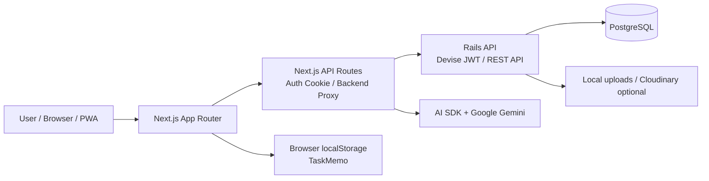
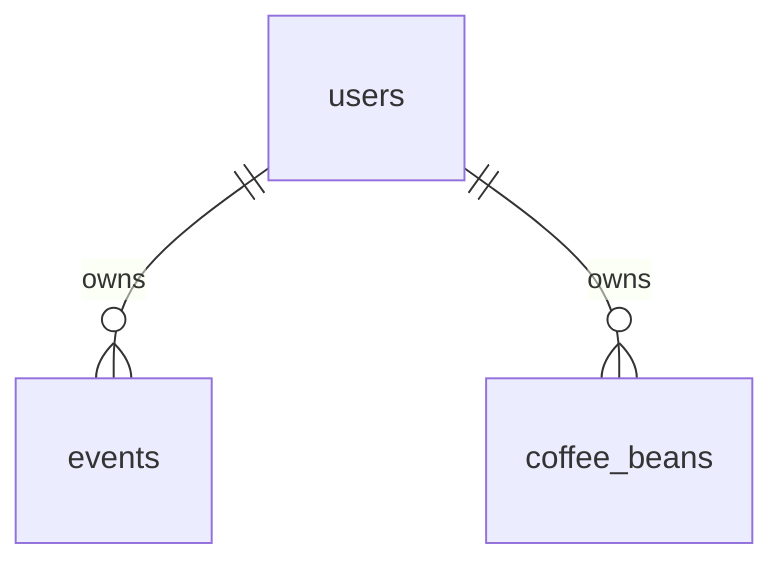

# Daily Life App ポートフォリオ

## 実装画面

<table>
  <tr>
    <td align="center" width="33%">
      
       
      カレンダー画面
    </td>
    <td align="center" width="33%">
      
       
      ボイスメモ画面
    </td>
    <td align="center" width="33%">
      
       
      コーヒー画像登録画面
    </td>
  </tr>
</table>

## 1. 概要

Daily Life App は、日常の予定管理、音声メモ、コーヒー豆記録を扱う個人向け PWA アプリケーションです。

スマートフォンと PC の両方で利用できることを意識し、予定管理・音声入力・画像解析など、日常的に使う機能を 1 つのアプリにまとめました。

主な機能は以下の 3 つです。

| 機能 | 内容 | 保存先 |
| --- | --- | --- |
| Calendar | 予定の作成・編集・削除、週表示・月表示、祝日表示、検索 | PostgreSQL |
| TaskMemo | 音声入力による文字起こしメモの作成、一覧表示、詳細表示、タイトル編集、削除 | localStorage |
| Coffee | コーヒー豆パッケージ画像の AI 解析、豆情報の管理 | PostgreSQL |

TaskMemo はフロントエンドのみで動作するローカル機能です。  
メモはブラウザの `localStorage` に保存し、Rails API / PostgreSQL には保存しません。

---

## 2. 開発背景

研究や日常生活の中で、予定・メモ・記録が複数のツールに分散してしまう課題がありました。

そこで、スマートフォンから素早く使える PWA として、予定管理・音声メモ・コーヒー記録をまとめて扱えるアプリを開発しました。

---

## 3. 技術スタック

### Frontend

- Next.js
- React
- TypeScript
- Tailwind CSS
- App Router
- PWA manifest / Service Worker

### Backend

- Ruby on Rails API
- PostgreSQL
- Devise + devise-jwt
- rack-cors
- rack-attack

### AI / 外部 API

- AI SDK
- Google Gemini API
- Web Speech API
- MediaRecorder API

### Infrastructure / Hosting

- Vercel
- AWS Route 53
- 独自ドメイン

---

## 4. アーキテクチャ

認証付き API 通信は、ブラウザから Rails へ直接送らず、Next.js の `/api/backend/*` を経由します。

JWT はブラウザ JavaScript から読めない HttpOnly Cookie に保存し、フロントエンド側でトークンを直接扱わない構成にしました。

---

## 5. 機能詳細

## 5.1 Calendar

### 目的

予定を週・月の単位で管理する機能です。  
日常の予定管理をスマートフォンでも扱いやすい UI として提供します。

### 主な機能

| 操作 | 内容 |
| --- | --- |
| 前へ / 次へ | 表示中の週または月を移動 |
| Today | 今日の日付へ戻る |
| 表示切替 | 週表示と月表示を切り替える |
| サイドバー | ミニカレンダーと直近イベント一覧を表示 |
| 検索 | タイトル・説明から予定を絞り込む |
| 予定作成 | 日付クリックまたは作成ボタンからモーダルを開く |
| 予定編集 | 既存イベントクリックで編集モーダルを開く |
| 予定削除 | 編集モーダルから削除 |

### 実装方針

Calendar は Rails API で予定の CRUD と祝日取得を行います。  
フロントエンドでは、週表示・月表示に必要な期間のイベントを取得し、表示形式に応じて配置を変えています。

---

## 5.2 TaskMemo

### 目的

短い音声メモをその場で文字起こしし、ブラウザ内に保存する機能です。

ログインやサーバー同期を不要にし、端末上で素早く記録できる軽量なメモ機能として提供します。

### 主な機能

| 操作 | 内容 |
| --- | --- |
| 録音開始 / 停止 | マイク入力を扱い、日本語文字起こしを行う |
| 新規メモ保存 | 録音結果または手入力した文字起こしを新規メモとして保存 |
| メモ一覧 | 保存済みメモを更新日時順に表示 |
| メモ詳細 | タイトル、作成日時、文字起こし本文を表示 |
| タイトル編集 | 既存メモのタイトルのみ更新 |
| メモ削除 | 選択中メモを削除 |

### 実装方針

TaskMemo は `localStorage` に保存し、音声文字起こし本文・タイトル・作成日時・更新日時を保持します。

録音ボタンは新規メモ作成専用です。  
既存メモを選択中に録音しても、既存メモの本文は更新しないようにし、新規作成と既存メモ編集の責務を分けました。

### 使用 API

- `MediaRecorder`
- `Web Speech API`
- `localStorage`

---

## 5.3 Coffee

### 目的

コーヒー豆のパッケージ画像から AI で商品情報を抽出し、コーヒー豆の記録を管理する機能です。

### 主な画面

| URL | 内容 |
| --- | --- |
| `/coffee` | コーヒー豆一覧 |
| `/coffee/new` | 画像アップロード・解析 |
| `/coffee/detail?id=:id` | 詳細表示 |

### 実装方針

Coffee の画像解析は Next.js API Route で実行します。  
AI SDK + Google Gemini API を使い、画像内の文字や商品情報を読み取ります。

---

## 6. データ設計

バックエンド側では、主に以下のデータを扱います。

### 主なテーブル

| テーブル | 内容 |
| --- | --- |
| users | 認証ユーザー |
| events | Calendar の予定 |
| holidays | 祝日情報 |
| coffee_beans | コーヒー豆情報 |

TaskMemo は `localStorage` 保存のため、DB テーブルを持ちません。

---

## 7. 工夫したこと

### Calendar の責務分離

Calendar は hook とコンポーネントを分け、表示、日付操作、API 通信、フォーム処理を追いやすくしました。

週表示・月表示・検索・フォーム操作が混ざると複雑になるため、処理単位を分けて保守しやすい構成にしました。

### AI 解析結果の確認フロー

Coffee の画像解析は、Mastra を使って実装しました。
Next.js API Route から画像解析処理を呼び出し、Mastra 側で Google Gemini API を利用して、画像内の文字や商品情報を読み取る構成にしています。

### TaskMemo のローカル機能化

TaskMemo はサーバー同期を持たせず、`localStorage` を使うことで、ログイン不要で素早く使えるローカル機能として切り出しました。

サーバーに保存する必要があるデータと、端末内で完結させるデータを分けて設計しました。

---

## 8. 苦労したこと

### 認証構成の整理

Rails の Devise JWT と Next.js API Routes の責務分離に苦労しました。

当初は、ブラウザ側で JWT を直接扱う構成も考えましたが、セキュリティ面を考慮し、HttpOnly Cookie と BFF を使う構成に整理しました。

### Calendar の表示ロジック

Calendar は週表示と月表示でイベントの見せ方が異なるため、表示ロジックが複雑になりました。

特に、日付移動、イベント取得、検索、モーダル状態が混ざると見通しが悪くなるため、hook とコンポーネントに分けて管理しました。

### Coffee の AI 解析フロー

Coffee は画像解析、プレビュー、保存、編集確認の流れが複数画面にまたがるため、データの流れを整理する必要がありました。

### TaskMemo の録音と保存タイミング

TaskMemo は録音、文字起こし、保存タイミングが重なるため、既存メモ更新と新規メモ作成の責務が混ざりやすい点に苦労しました。

録音は新規メモ作成専用とし、既存メモではタイトル編集のみを行うことで、操作の意味を明確にしました。

---

## 9. 今後の改善点

### Calendar

- 通知機能を追加する

### TaskMemo

- mastraを活用する
- Markdown / CSV などのエクスポート機能を追加する

### Coffee

- 過去データを使った候補補完を追加する
- 画像解析結果の候補補完を改善する

### デモ環境

- API 接続なしでも操作できるデモモードを用意する
- ポートフォリオ閲覧時に、ログインやバックエンド起動なしで主要画面を確認できるようにする

### 将来的な拡張

- AI 解析処理をワークフロー化し、解析・検証・保存前チェックを分離する
- モバイルアプリ化し、カメラ・マイク・通知機能をより自然に扱える形にする
