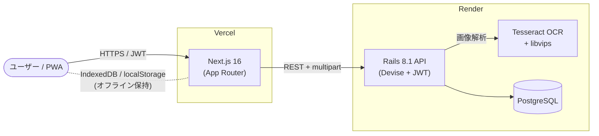

# Daily Life App

> 日常生活の管理を 1 つにまとめた、スマホネイティブ感覚の PWA。
> カレンダー・コーヒー豆 AI 解析・ボイスメモを統合した個人向けライフログツールです。

🔗 **[デモを見る](https://daily-life-app.vercel.app)**

     

---

## スクリーンショット

| カレンダー | コーヒー豆 AI 解析 | ボイスメモ |
| :---: | :---: | :---: |
|  |  |  |

> ※ スクリーンショットは順次追加予定です。

---

## 主な機能

### カレンダー
月・週・日・年・スケジュールの **5 ビュー切替**で予定を管理。祝日自動表示、カラーラベル、キーワード検索に対応。
ドラッグ＆ドロップで予定の移動・リサイズが可能です。

### コーヒー豆 AI 解析
PostCoffee のパッケージ画像から、**Tesseract OCR + 独自パーサ**で商品名・産地・焙煎度・フレーバーノーツ等を自動抽出。
撮影 → 確認 → 保存 までを最短 30 秒で完了します。

### ボイスメモ
ブラウザマイクで録音し、メモ・タグと一緒に保存。
**IndexedDB によるオフライン保存** とサーバー同期を両立し、オンライン復帰時に自動同期します。

<details>
<summary>各機能の詳細仕様を開く</summary>

#### カレンダー ビュー一覧
- 月 / 週 / 日 / 年 / スケジュール（リスト形式）
- 予定の作成・編集・削除（モーダル UI）
- サイドバーにミニカレンダーと直近の予定一覧

#### コーヒー豆 記録できる情報
ブランド・商品コード / 商品名（英語・日本語） / 産地・地域 / 焙煎度 / 精製方法 / フレーバーノーツ / 品種 / 標高 / 農家・農園 / Limited フラグ / テイスティングノート（スコア・感想）

#### ボイスメモ 対応形式
WebM / M4A / WAV（ブラウザの MediaRecorder API に依存）

</details>

---

## 技術スタック

### フロントエンド

| 技術 | バージョン | 選定理由 |
| --- | --- | --- |
| Next.js | 16.2.5 | App Router で SSR / 静的最適化を両立。Vercel との親和性 |
| React | 19.2.4 | React Compiler を有効化し、手動メモ化を削減 |
| TypeScript | 5 | 型安全な開発と IDE 支援 |
| Tailwind CSS | 4 | ユーティリティファーストで UI を高速に組み上げる |
| @dnd-kit/core | 6 | カレンダーの予定ドラッグ＆ドロップ |

### バックエンド

| 技術 | 選定理由 |
| --- | --- |
| Ruby on Rails 8.1（API-only） | フロントと分離した REST API 構成 |
| PostgreSQL | jsonb による柔軟なメタデータ保存（タグ等） |
| Devise + devise-jwt | JWT ベースの認証・トークン失効 |
| rack-cors | フロント（Vercel ドメイン）からの CORS 許可 |
| Tesseract OCR | コーヒーパッケージ画像のテキスト抽出 |
| libvips / ruby-vips | OCR 前処理（コントラスト・解像度調整で精度向上） |

### インフラ・デプロイ

| サービス | 用途 |
| --- | --- |
| **Vercel** | フロントエンドのホスティング・自動デプロイ |
| **Render** | Rails API のホスティング（Free プラン） |
| **Render Managed PostgreSQL** | データベース |

---

## アーキテクチャ



---

## 技術的な見どころ

ポートフォリオとして特に注力したポイントです。

### 1. Tesseract OCR + 独自パーサで「撮るだけ登録」を実現
コーヒー豆のパッケージ写真から商品情報を自動抽出。libvips で前処理（コントラスト・解像度調整）を挟むことで OCR 精度を底上げし、行レイアウト解析でブランド・産地・フレーバーノーツを項目別に振り分けます。

### 2. IndexedDB によるオフラインファースト
ボイスメモは録音直後にローカル（IndexedDB）に保存。オンライン時はサーバーへ自動同期、オフラインでも一切操作が止まりません。同期状態は `local / pending / synced / error` の 4 段階でユーザーに可視化しています。

### 3. Web Speech API を使ったリアルタイム文字起こし（再構築中）
`/taskmemo` ページで録音と同時に音声をテキスト化。録音ファイル本体とテキストの両方を残し、後から検索できる構造に再設計中です（仕様: [taskmemo仕様書.md](taskmemo仕様書.md)）。

### 4. React 19 + React Compiler
手動の `useMemo` / `useCallback` を最小限にし、コンパイラ最適化に任せる構成。コードのノイズを減らしつつ再レンダリングを抑制しています。

### 5. PWA / ホーム画面追加対応
スマートフォンのホーム画面に追加するとネイティブアプリ感覚で起動できる構成。マイク・カメラへのアクセスもブラウザ権限経由で完結します。

---

## デプロイ構成

- **フロントエンド**: GitHub の `main` ブランチ更新で Vercel が自動的にビルド・公開
- **バックエンド**: Render の自動デプロイ（Rails の API-only モード）
- **データベース**: Render Managed PostgreSQL（バックエンドと同 VPC）
- **環境変数**: フロント側は `NEXT_PUBLIC_API_BASE_URL` で API ドメインを指定

---

## 今後の展望

- `/taskmemo` ページの再構築（音声 + 文字起こしを軸にした保存・検索）
- 多言語対応（現状は日本語固定）

---

## 開発者向け（ローカル起動）

<details>
<summary>セットアップ手順を開く</summary>

```bash
# フロントエンド
cd frontend
npm install
npm run dev   # http://localhost:3000

# バックエンド
cd backend
bundle install
bin/rails db:setup
bin/rails s   # http://localhost:3001
```

`frontend/.env.local`:
```
NEXT_PUBLIC_API_BASE_URL=http://localhost:3001
```

</details>
